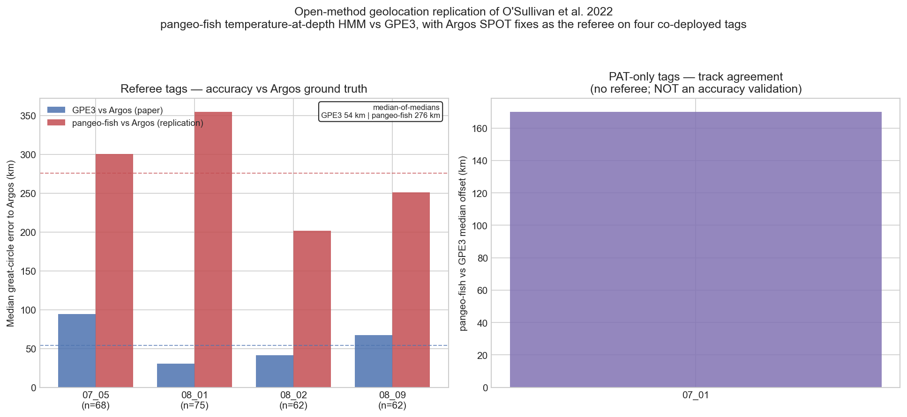

# white-shark-geolocation-replication

[](https://github.com/annefou/white-shark-geolocation-replication/actions/workflows/ci.yml)
[](https://annefou.github.io/white-shark-geolocation-replication/)
[](https://github.com/annefou/white-shark-geolocation-replication/pkgs/container/white-shark-geolocation-replication)
[](https://opensource.org/licenses/MIT)
[]({{ZENODO_DOI}})
[](docs/fair4rs-checklist.md)
[](https://forrt.org/)
[](nanopubs/PUBLISHED.md)
[](ro-crate-metadata.json)

> **Can an open method reproduce the juvenile white shark geolocations of O'Sullivan et al. (2022)?**
> Reference paper: [10.1038/s41597-022-01235-3](https://doi.org/10.1038/s41597-022-01235-3) · Data archive: [10.24431/rw1k6c3](https://doi.org/10.24431/rw1k6c3)

The reference paper released daily geolocations for juvenile white sharks (*Carcharodon carcharias*) computed by **GPE3** — a *proprietary* light-plus-SST hidden Markov model that runs on a vendor portal and cannot be re-run from the public data. This is a **Replication Study (different methodology)**: it re-derives the daily positions with a **fully open** method — [`pangeo-fish`](https://github.com/pangeo-fish/pangeo-fish), a HEALPix-NESTED hidden Markov model matching tag *temperature-at-depth* against the GLORYS12V1 ocean reanalysis — and compares the two against **Argos SPOT fixes as an independent accuracy referee** (GPE3 is never treated as ground truth).

**Headline result:** in a deliberately *minimal* configuration (temperature-only emission, endpoint anchors), the open method is materially less accurate than the proprietary GPE3 — **median 276 km vs 54 km** great-circle error to the Argos referee across four co-deployed tags. The gap is diagnosed (the Brownian σ saturates → weak thermal constraint), and the result **qualifies** the *reproducibility* of the released geolocations with open tooling without disputing the paper's correctness. This is a baseline; the method has substantial unused headroom (multi-signal fusion, acoustic anchoring, finer assimilative fields — see [the Outcome's limitations](nanopubs/drafts/05_outcome.md)).

It produces a reproducible computational pipeline, a Zenodo-archived release with a citable DOI, and a FORRT-tagged nanopublication chain on the [Science Live platform](https://platform.sciencelive4all.org).

---

## Quick start

```bash
git clone https://github.com/annefou/white-shark-geolocation-replication.git
cd white-shark-geolocation-replication
pixi install
pixi run snakemake --cores 1
```

(Pixi resolves `pixi.toml` against the per-platform `pixi.lock`, installs the env under `.pixi/`, and provides `pixi run` for any task without needing an `activate` step.)

### Data & credentials

The pipeline downloads its own inputs on first run (`notebooks/01_data_download.py`) — no manual data prep, and everything is cached so re-runs skip files already on disk. There are two sources, one of which needs a free account:

- **Biologging archive** ([10.24431/rw1k6c3](https://doi.org/10.24431/rw1k6c3), CC-BY) — public, **no credentials**.
- **GLORYS12V1 ocean reanalysis** (Copernicus Marine `GLOBAL_MULTIYEAR_PHY_001_030`, the field the HMM matches temperature-at-depth against) — needs a **free Copernicus Marine account**:
  1. Register at <https://data.marine.copernicus.eu/register>.
  2. Run `copernicusmarine login` once — it writes the credentials to `~/.copernicusmarine/.copernicusmarine-credentials`.
  3. `pixi run snakemake --cores 1` then fetches everything (GLORYS is subset per tag to its deployment window + bounding box; ~0.7 GB raw).

Without Copernicus credentials the archive still downloads, but the GLORYS step fails. **Reading the results needs no credentials at all:** the [Jupyter Book](https://annefou.github.io/white-shark-geolocation-replication/) and its figures build from the committed executed notebooks — only re-running the analysis from scratch requires the account.

For CI, supply the credentials file base64-encoded as the `COPERNICUS_CREDENTIALS_BASE64` GitHub Actions secret (see `DOMAIN.md` and the commented block in `.github/workflows/ci.yml`).

Or with Docker:

```bash
docker run --rm ghcr.io/annefou/white-shark-geolocation-replication:latest
```

The Jupyter Book version is at <https://annefou.github.io/white-shark-geolocation-replication/>.

## Results

Open `pangeo-fish` (temperature-at-depth HMM) vs the paper's proprietary GPE3 (light+SST), judged against co-deployed Argos SPOT fixes (the independent referee — GPE3 is *not* ground truth). Median great-circle error to Argos, same fixes for both methods:

| Tag | Argos fixes | pangeo-fish vs Argos | GPE3 vs Argos | fitted σ |
|---|---|---|---|---|
| 07_05 | 68 | 300.3 km | 94.5 km | 0.0070 (interior) |
| 08_01 | 75 | 354.5 km | 30.4 km | 0.0937 (at bound) |
| 08_02 | 62 | 201.8 km | 41.3 km | 0.0937 (at bound) |
| 08_09 | 62 | 251.1 km | 67.0 km | 0.0937 (at bound) |
| **aggregate** (median of medians) | | **276 km** | **54 km** | |



**Interpretation.** The open method, in this minimal configuration, is ~3–12× less accurate than the tuned proprietary GPE3. The fitted Brownian σ saturating at its upper bound for 3 of 4 tags is diagnostic: the temperature-at-depth signal is weakly constraining (smooth fields → flat likelihood), unlike GPE3's clock-sharp light longitude. **Honest scope:** this is a *floor* for a bare configuration, not a verdict on `pangeo-fish` — which supports multi-signal emissions (open light geolocation, SST, salinity, bathymetry) and known reference-point/acoustic anchoring that were not used here. Two tags were excluded for documented reasons (02_01: PAT2 with no external temperature sensor; 06_10: basin-scale roamer whose HMM state space exceeds the single-kernel memory budget — dropped best-effort). Full numbers in [`results/summary.csv`](results/summary.csv); honest verdict and limitations in [`nanopubs/drafts/05_outcome.md`](nanopubs/drafts/05_outcome.md).

## Built from a template

This repository was created from [`sciencelivehub/forrt-replication-template`](https://github.com/sciencelivehub/forrt-replication-template). The template ships an operating manual for AI assistants ([`CLAUDE.md`](CLAUDE.md), [`AGENTS.md`](AGENTS.md)), domain conventions ([`DOMAIN.md`](DOMAIN.md)), and reference docs (`docs/`) so that an AI working only inside this repository can guide a researcher from "paper PDF + GitHub repo" to "published FORRT chain + Zenodo DOI" with no other context.

If you are reading this in a fresh fork, run [`/init-template`](.claude/skills/init-template/SKILL.md) inside Claude Code to substitute the placeholder tokens with your details. (For other AI tools, see [`docs/ai-portability.md`](docs/ai-portability.md).)

After `/init-template`, do these one-time setup steps to enable the full CI/CD path:

- **Enable GitHub Pages** at *Settings → Pages → Source: GitHub Actions*. Until enabled, the Jupyter Book build runs but the deploy step is skipped (CI stays green).
- The CI workflows ship with **scaffold-detection guards** — they run end-to-end only after you implement Phase 2 (the `notebooks/*.py` files). Until then they exit early with an informative `::notice::` and the badges stay green.

## Repository structure

```
.
├── CLAUDE.md / AGENTS.md       # operating manual for AI assistants
├── DOMAIN.md                   # domain flavour (current: biodiversity + earth observation)
├── USER_PREFERENCES.md         # per-user style (edit on first clone)
├── README.md                   # this file
├── LICENSE                     # MIT
├── CITATION.cff                # how to cite
├── codemeta.json               # software metadata (CodeMeta-2.0)
├── ro-crate-metadata.json      # research object packaging (RO-Crate 1.2)
├── pixi.toml + pixi.lock       # pinned dependencies (single source of truth; lockfile is per-platform)
├── Dockerfile                  # container build
├── Snakefile                   # pipeline orchestration
├── myst.yml + index.md         # Jupyter Book scaffold
├── paper/                      # the source paper PDF
├── data/                       # downloaded artefacts (gitignored)
├── notebooks/                  # jupytext .py pipeline (01–04)
├── nanopubs/                   # FORRT chain drafts + published-URI registry
├── docs/                       # reference material
├── figures/                    # curated figures used in the Jupyter Book
├── .github/workflows/          # CI, Jupyter Book, Docker
└── .claude/                    # Claude Code agents, skills, sandbox config
```

## What you get

This template bakes in conventions that took multiple replications to discover. By using it, you inherit:

- **FAIR4RS conformance** — see [`docs/fair4rs-checklist.md`](docs/fair4rs-checklist.md) for the principle-by-principle mapping.
- **Self-contained data downloads** — the first notebook fetches everything; no manual data prep.
- **`pixi.toml` + `pixi.lock` as single source of truth** — local dev, Docker, and CI all install the same per-platform-pinned env.
- **`prefix-dev/setup-pixi`-based CI** — caches the env, runs the pipeline with `pixi run`, executes notebooks via a glob, fails fast on a stale lockfile.
- **Jupyter Book deployment** — auto-deploys to GitHub Pages with `BASE_URL` set correctly. (Don't put `base_url` in `myst.yml` — MyST silently ignores it.)
- **Docker + GHCR + Zenodo image archival** — `release` trigger pushes to GHCR and (optionally) archives to Zenodo for long-term preservation.
- **RO-Crate packaging** — the entire repo is a navigable Research Object via `ro-crate-metadata.json` (Process Run Crate + Workflow RO-Crate profiles).
- **Six-step FORRT chain workspace** — `nanopubs/drafts/` has a field-by-field skeleton for each step. `nanopubs/PUBLISHED.md` is the URI registry.
- **Layered AI guidance** — `CLAUDE.md` (universal) + `DOMAIN.md` (swappable per field) + `USER_PREFERENCES.md` (per-user). See [`docs/ai-portability.md`](docs/ai-portability.md) for non-Claude AI tools.
- **Sandbox by default** — `.claude/settings.json` denies file ops outside the repo, so a fresh AI session can't accidentally read `~/.ssh/` or write to `/etc/`.

## The six FORRT chain steps

A complete FORRT chain has six steps published on [platform.sciencelive4all.org](https://platform.sciencelive4all.org):

```
Quote-with-comment  →  AIDA  →  FORRT Claim  →  Replication Study  →  Replication Outcome  →  CiTO Citation
```

(For question-rooted chains with no upstream paper, replace step 1 with PICO or PCC. See [`docs/chain-decision-tree.md`](docs/chain-decision-tree.md).)

Drafts live in [`nanopubs/drafts/`](nanopubs/drafts/) field-by-field. Published URIs go into [`nanopubs/PUBLISHED.md`](nanopubs/PUBLISHED.md).

Optional further layers:

- **Research Software nanopub** — for reusable upstream tools (not demo repos). See [`docs/forrt-form-fields.md`](docs/forrt-form-fields.md) § Research Software.
- **Research Synthesis nanopub** — when this chain is part of a multi-chain story. See [`docs/forrt-form-fields.md`](docs/forrt-form-fields.md) § Research Synthesis.

## After publishing

When the chain is live and the FAIR4RS checklist is green, drafting an announcement post is the next step. See [`docs/announcement-template.md`](docs/announcement-template.md) for the structural template (vision-piece-first; the worked replication is the payoff, not the lead).

For lower-level nanopub work — retraction, superseding, batch publishing — see [`docs/programmatic-nanopubs.md`](docs/programmatic-nanopubs.md).

## Citation

If you use this work, please cite both:

- This software: [`CITATION.cff`](CITATION.cff) → DOI [{{ZENODO_DOI}}]({{ZENODO_DOI}})
- The original paper: [10.1038/s41597-022-01235-3](https://doi.org/10.1038/s41597-022-01235-3)

## Acknowledgements

This repository was built from [`sciencelivehub/forrt-replication-template`](https://github.com/sciencelivehub/forrt-replication-template), part of the [Science Live platform](https://platform.sciencelive4all.org). The template is licensed MIT and contributions (especially new domain flavours under [`docs/domain-flavours/`](docs/domain-flavours/)) are welcome.
